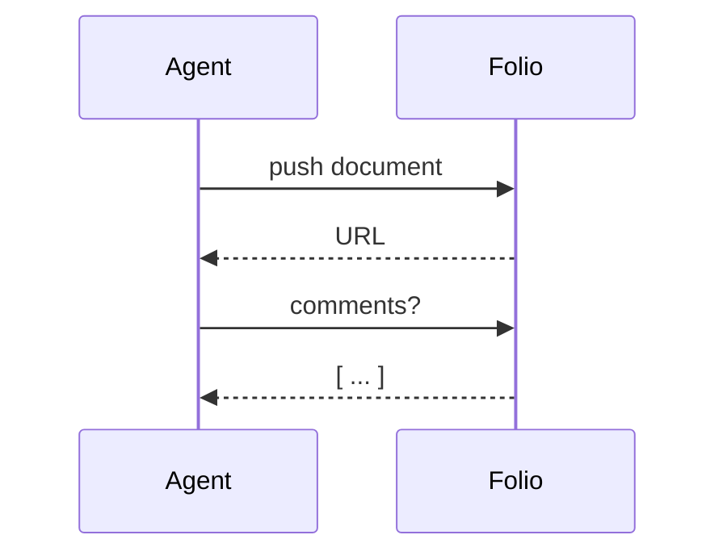
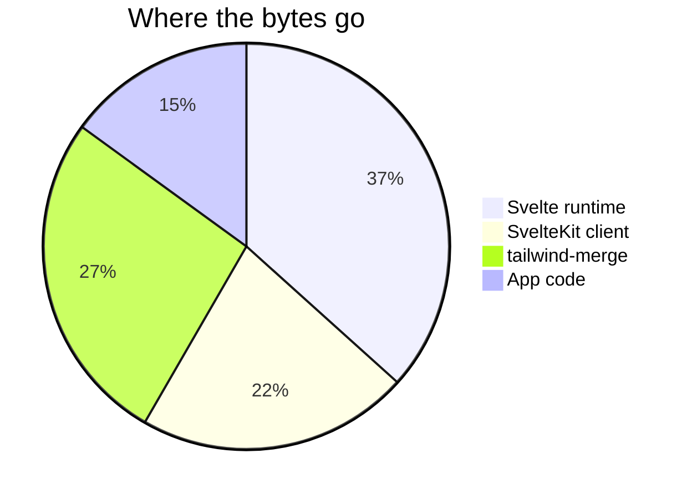
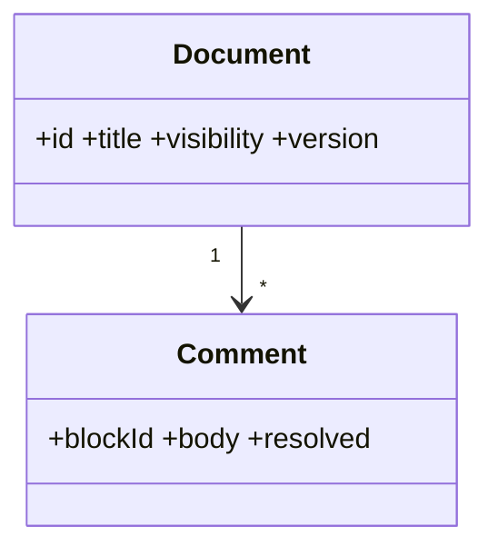
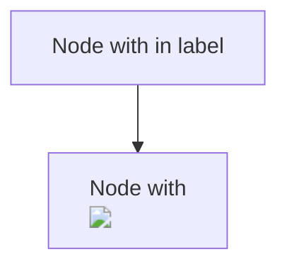

# Torture test: every edge the renderer should survive

This document exists to break things. Every section targets a specific failure mode: sanitization, layout, overflow, slug collisions, math, diagrams, and pathological inputs. If something looks wrong here, it is a bug in the renderer or the stylesheet.

## Headings

# H1 inside the body (should be smaller than the page title)

## H2

### H3

#### H4

##### H5

###### H6

####### Seven hashes is a paragraph, not a heading

## Headings

## Headings

## HEADINGS

Three identical headings above must get distinct ids and three distinct table-of-contents entries.

##

## `code` in a heading with **bold** and a [link](https://example.com)

## Heading ending with hashes

## 日本語の見出し and emoji 🚀🎉

Setext heading one
==================

Setext heading two
------------------

## Injection attempts

All of these must render as inert text or be dropped entirely. None may execute.

<script>alert('xss')</script>

<iframe src="https://example.com"></iframe>
<a href="javascript:alert(1)">javascript link in raw HTML</a>
<div onclick="alert(1)">clickable div</div>
<style>body { display: none }</style>
<svg onload="alert(1)"></svg>
<details open><summary>raw details</summary>hidden content</details>
<form action="https://evil.example"><input name="q"><button>submit</button></form>
<base href="https://evil.example/">
<meta http-equiv="refresh" content="0;url=https://evil.example">
<object data="https://evil.example"></object>
<embed src="https://evil.example">
<math><mi>x</mi></math>

[javascript link](<javascript:alert(1)>)
[data link](data:text/html;base64,PHNjcmlwdD5hbGVydCgxKTwvc2NyaXB0Pg==)
[vbscript link](vbscript:msgbox)
[file link](file:///etc/passwd)
[mailto link](mailto:someone@example.com)
[relative link](/d/other-document)
[fragment link](#headings)
[protocol-relative](//evil.example/path)
[tab in scheme](java script:alert(1))
[link with title](https://example.com 'A title with "quotes"')
<https://autolink.example.com/path?query=1&two=2>
https://bare-url.example.com/gets/autolinked

>)


&lt;script&gt;entities stay text&lt;/script&gt; &amp; &copy; &#169; &#x1F600; &unknownentity;

\<not a tag\> \*not emphasis\* \`not code\` \# not a heading

## Overflow and width

A single unbreakable token: Pneumonoultramicroscopicsilicovolcanoconiosis_supercalifragilisticexpialidocious_antidisestablishmentarianism_floccinaucinihilipilification_hippopotomonstrosesquippedaliophobia_x_y_z_0123456789_0123456789_0123456789

A very long URL that must not push the layout sideways: https://example.com/a/very/long/path/that/keeps/going/and/going/with/query/parameters?one=1&two=2&three=3&four=4&five=5&six=6&seven=7&eight=8&nine=9&ten=10&eleven=11&twelve=12&thirteen=13

`inline code that is also extremely long and has no spaces at all so it cannot wrap anywhere inside the line box at all: abcdefghijklmnopqrstuvwxyzabcdefghijklmnopqrstuvwxyzabcdefghijklmnopqrstuvwxyz`

```text
A code block with one very long line that should scroll horizontally rather than wrap or overflow: 0123456789 0123456789 0123456789 0123456789 0123456789 0123456789 0123456789 0123456789 0123456789 0123456789 0123456789 0123456789 0123456789 0123456789
```

| A very wide table | with many columns | that should scroll | rather than squash          | the reading column | column six | column seven  | column eight | column nine | column ten |
| ----------------- | ----------------- | ------------------ | --------------------------- | ------------------ | ---------- | ------------- | ------------ | ----------- | ---------- |
| a                 | b                 | c                  | d                           | e                  | f          | g             | h            | i           | j          |
| `code`            | **bold**          | _em_               | [link](https://example.com) | $x^2$              | ~~del~~    | line<br>break | 1 \| 2       | trailing    |            |

| Left             |       Center       |             Right |
| :--------------- | :----------------: | ----------------: |
| l                |         c          |                 r |
| longer left cell | longer center cell | longer right cell |

| Header only |
| ----------- |

Not a table | just pipes | in a paragraph

## Lists

1. Ordered
2. List
   1. Nested ordered
   2. Second nested
      - Bullet inside ordered
      - Another
        1. Ordered inside bullet inside ordered
           - [ ] Task inside all of that
           - [x] Done task inside all of that
             > A blockquote inside a task inside a list inside a list inside a list
             >
             > ```js
             > console.log('code inside blockquote inside nested list');
             > ```
3. Back to top level

4. List starting at five
5. Six
6. Seven

- Loose list item one

- Loose list item two has a second paragraph.

  Second paragraph of item two.

  ```py
  print("code block inside a loose list item")
  ```

- Loose list item three

* Star bullet

- Plus bullet

* Dash bullet

* [ ] Unchecked
* [x] Checked
* [x] Checked with capital X
* [ ]Missing space is not a task
* [] Empty brackets is not a task

1. Parenthesis ordered
2. Second

Term
: Definition lists are not GFM, so this is a paragraph.

## Emphasis and inline

**bold** **bold** _em_ _em_ _**both**_ ~~strike~~ ~~single tilde~~ `code` ``code with ` backtick`` ` `` `

**unclosed bold *unclosed em ~~unclosed strike `unclosed code

snake_case_word and 2*3*4 and a*b* and _under_score_ and **dunder__init**

Hard break with two spaces  
next line. Hard break with backslash\
next line. Soft break
same paragraph.

Trademark™ — em dash – en dash … ellipsis "smart quotes" 'single' «guillemets» ¿inverted? ¡yes!

Right-to-left: مرحبا بالعالم. Hebrew: שלום עולם. Mixed: hello עולם world.

Combining marks: é (e + acute) and Z̸̧̨̛͚̺̼̘̘̖͙̻̘̥̜̤͇͉̭͖̠̝͈̼̙̈́̀͗͊̀̍̌̌̋͛͆͐̀̋̀̚͜͝ͅa̸̜̬̖͖͇̜̻̯͔̻͎̙̬̍͐̀͊̃̊͒͊̈́̑͒̽͘͝ͅl̶̢̢̛̻̝̹̻̪̝̩̯͚̩̜̙̲̳̳͖͔̹̘̈̀̈́͒̊͐̓̌̽̊̀̍̚̕g̸̟̱̠͖̜̹̹͓͍̿͗̈́́͛̔͒̚͜͝ͅo̷͖̯̼͚̞̲̺͈͒̄̄̽̇̕ text.

Zero-width characters: a​b‌c‍d (ZWSP, ZWNJ, ZWJ between letters). Emoji sequences: 👨‍👩‍👧‍👦 🏳️‍🌈 👍🏽.

## Blockquotes

> Level one
>
> > Level two
> >
> > > Level three with **bold** and `code`
>
> Back to level one after a blank quote line.

> # Heading inside a quote
>
> - list inside a quote
> - second item
>
> | table | in quote |
> | ----- | -------- |
> | a     | b        |

> Lazy continuation
> works like this.

## Code

```
No language at all.
```

```unknownlang
This language does not exist and must fall back to plain text without an error.
```

```TypeScript
// Capitalised language name
const x: number = 1;
```

```ts title="with-meta.ts" {1,3}
// Fence meta string should be ignored
export const a = 1;
```

```python
# Tilde fences
def f(): return "tilde"
```

````markdown
```js
// A fence inside a fence
```
````

```html
<script>
	alert('code blocks show raw html safely');
</script>

```

```mermaid
this is not valid mermaid syntax %%%% {{{{
```

```json
{
	"deep": {
		"nested": { "object": { "with": { "many": { "levels": [1, 2, 3, { "and": "objects" }] } } } }
	}
}
```

```diff
- removed line
+ added line
  context line
```

```sql
SELECT id, title FROM document WHERE ownerId = ? ORDER BY updatedAt DESC;
```

```rust
fn main() { println!("{}", (1..=10).map(|n| n * n).sum::<u32>()); }
```

```bash
for f in *.md; do folio push "$f" --visibility unlisted; done
```

    Indented code block
    with two lines

Inline: `<script>` and `$x$` and `**not bold**` and `[not](a-link)`.

## Math

Inline $E = mc^2$ and $\frac{a}{b}$ and $\sum_{i=0}^{n} i^2$ and dollar signs in prose: it costs $5 and $10, which is not math.

$$
\begin{aligned}
\nabla \cdot \mathbf{E} &= \frac{\rho}{\varepsilon_0} \\
\nabla \cdot \mathbf{B} &= 0 \\
\nabla \times \mathbf{E} &= -\frac{\partial \mathbf{B}}{\partial t} \\
\nabla \times \mathbf{B} &= \mu_0 \mathbf{J} + \mu_0 \varepsilon_0 \frac{\partial \mathbf{E}}{\partial t}
\end{aligned}
$$

$$
\text{A very wide equation: } \int_{-\infty}^{\infty} \int_{-\infty}^{\infty} \int_{-\infty}^{\infty} \int_{-\infty}^{\infty} \int_{-\infty}^{\infty} e^{-(x_1^2 + x_2^2 + x_3^2 + x_4^2 + x_5^2)} \, dx_1 \, dx_2 \, dx_3 \, dx_4 \, dx_5 = \pi^{5/2}
$$

$$
\undefinedmacro{this is invalid latex and must not crash the page}
$$

$$
\href{javascript:alert(1)}{katex href must be neutralised}
$$

$$
\begin{matrix} a & b \\ c & d \end{matrix} \quad \begin{pmatrix} 1 & 0 \\ 0 & 1 \end{pmatrix}
$$

## Diagrams









## Footnotes

Multiple footnotes[^one] in one paragraph[^two], a reused one[^one], and an undefined one[^nope].

[^one]: The first footnote.

[^two]: The second footnote has _emphasis_, `code`, and a link to [example](https://example.com).

    And an indented second paragraph.

## Duplicate blocks

Same paragraph.

Same paragraph.

Same paragraph.

---

---

---

---

## Reference links

[Defined reference][ref] and [undefined reference][nope] and [collapsed][] and [shortcut].

[ref]: https://example.com/reference 'Reference title'
[collapsed]: https://example.com/collapsed
[shortcut]: https://example.com/shortcut

## Empty things

Empty inline code: `` ` `` and ` ` and an empty link: [](<>) and an empty image: 

```

```

>

-

1.

## Unicode and whitespace

Tabs between words. Non-breaking spaces here. Full-width ＡＢＣ　and　ideographic space. Line separator: ab.

## Extremely long paragraph

Lorem ipsum dolor sit amet, consectetur adipiscing elit, sed do eiusmod tempor incididunt ut labore et dolore magna aliqua. Ut enim ad minim veniam, quis nostrud exercitation ullamco laboris nisi ut aliquip ex ea commodo consequat. Duis aute irure dolor in reprehenderit in voluptate velit esse cillum dolore eu fugiat nulla pariatur. Excepteur sint occaecat cupidatat non proident, sunt in culpa qui officia deserunt mollit anim id est laborum. Lorem ipsum dolor sit amet, consectetur adipiscing elit, sed do eiusmod tempor incididunt ut labore et dolore magna aliqua. Ut enim ad minim veniam, quis nostrud exercitation ullamco laboris nisi ut aliquip ex ea commodo consequat. Duis aute irure dolor in reprehenderit in voluptate velit esse cillum dolore eu fugiat nulla pariatur. Excepteur sint occaecat cupidatat non proident, sunt in culpa qui officia deserunt mollit anim id est laborum. Lorem ipsum dolor sit amet, consectetur adipiscing elit, sed do eiusmod tempor incididunt ut labore et dolore magna aliqua.

## Unclosed fence at the very end

```js
// This fence never closes. Everything after it is code, including the frontmatter-looking lines below.
---
title: not frontmatter
---
```
